<p align="center">
  
</p>

# Klucz do Kosmosu

```
OŚWIADCZENIE LICENCYJNE PROJEKTU / PROJECT LICENSE NOTICE

PL: Cała zawartość tego repozytorium, w tym pliki projektowe programu KiCad (schematy i projekty płytek PCB) oraz dokumentacja techniczna, udostępniana jest na licencji:
Creative Commons Uznanie autorstwa - Użycie niekomercyjne - Na tych samych warunkach 4.0 Międzynarodowe (CC BY-NC-SA 4.0).

Pełna treść licencji dostępna jest pod adresem: https://creativecommons.org/licenses/by-nc-sa/4.0/legalcode.txt

WARUNKI SZCZEGÓŁOWE I INTENCJA AUTORA:
1. UŻYTEK NIEKOMERCYJNY: Zezwala się na kopiowanie, modyfikowanie oraz wytwarzanie fizycznych egzemplarzy urządzenia wyłącznie do celów niekomercyjnych, prywatnych, hobbystycznych (np. przez krótkofalowców, majsterkowiczów) oraz statutowych (przez organizacje pozarządowe / NGO).
2. SPECJALNE ZEZWOLENIE DLA PLACÓWEK OŚWIATOWYCH: Oficjalne szkoły, uczelnie wyższe oraz inne placówki dydaktyczne są wyraźnie uprawnione do wytwarzania oraz zlecania produkcji tego urządzenia (w tym zamawiania partii płytek PCB w zewnętrznych przedsiębiorstwach) na własne, wewnętrzne potrzeby edukacyjne i szkoleniowe.
3. OZNACZENIE AUTORA NA PCB (WARUNEK "BY"): Zgodnie z warunkiem Uznania Autorstwa, zabrania się usuwania, modyfikowania lub zakrywania oznaczeń autora (nazwiska, nicku lub logo) umieszczonych na warstwie opisowej (silkscreen) płytki PCB. Każda wyprodukowana płytka musi te oznaczenia zachować w oryginalnej formie.

--------------------------------------------------------------------------------

EN: All contents of this repository, including KiCad design files (schematics and PCB layouts) and technical documentation, are licensed under:
Creative Commons Attribution-NonCommercial-ShareAlike 4.0 International (CC BY-NC-SA 4.0).

The full license legal code is available at: https://creativecommons.org/licenses/by-nc-sa/4.0/legalcode.txt

SPECIFIC TERMS AND AUTHOR'S INTENT:
1. NON-COMMERCIAL USE: Copying, modifying, and manufacturing physical units of this device is permitted strictly for non-commercial, private, hobbyist (e.g., amateur radio operators, makers), and non-profit/NGO institutional purposes.
2. SPECIAL PERMISSION FOR EDUCATIONAL INSTITUTIONS: Official schools, universities, and educational organizations are explicitly authorized to manufacture and order the production of this hardware (including batch PCB fabrication from commercial manufacturers) solely for their own internal educational and instructional purposes.
3. PCB ATTRIBUTION (THE "BY" CONDITION): In accordance with the Attribution requirement, it is strictly forbidden to remove, alter, or obscure the author's identification (name, handle, or logo) placed on the silkscreen layer of the PCB. Any manufactured circuit board must retain these markings in their original form.

```

**Dokumentacja techniczna – edukacyjne urządzenie elektroniczne, wersja szkolna**

Projekt powstał na zlecenie Polskiej Agencji Kosmicznej na potrzeby działań edukacyjnych dla misji IGNIS. Realizatorami misji IGNIS byli: Ministerstwo Rozwoju i Technologii, Polska Agencja Kosmiczna i Europejska Agencja Kosmiczna.
Projekt wyprodukowano i rozdano w liczbie 100 000 egzemplarzy, nieodpłatnie do polskich szkół.

Na prośby kierowane do POLSA, projekt udostępniony jest dla hobbystów i wszystkich zainteresowanych niekomercyjnym jego użyciem.

<p align="center">
  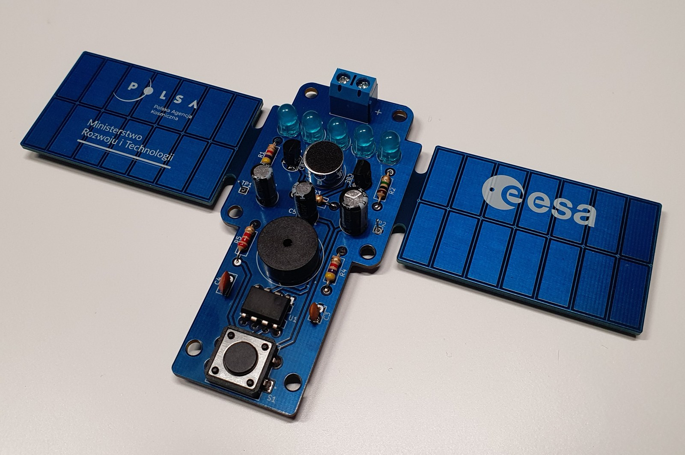
</p>

## Spis treści

- [Słownik skrótów](#słownik-skrótów)
- [1. Wprowadzenie](#1-wprowadzenie)
- [2. Specyfikacja techniczna](#2-specyfikacja-techniczna)
- [3. Opis urządzenia](#3-opis-urządzenia)
- [4. Lista komponentów (BOM)](#4-lista-komponentów-bom)
- [5. Testy](#5-testy)
- [6. Informacje dotyczące produkcji](#6-informacje-dotyczące-produkcji)

## Słownik skrótów

| Skrót | Rozwinięcie |
|-------|-------------|
| BOM   | Bill of Materials |
| FR    | Flame Retardant |
| HAL   | Hot Air Leveling |
| ISS   | International Space Station |
| LED   | Light-Emitting Diode |
| PCB   | Printed Circuit Board |
| STEM  | Science, Technology, Engineering, Mathematics |
| THT   | Through-Hole Technology |
| USB   | Universal Serial Bus |

## 1. Wprowadzenie

Niniejsza dokumentacja techniczna zawiera kluczowe informacje na temat projektu edukacyjnego urządzenia elektronicznego *Klucz do kosmosu*, zaprojektowanego dla Polskiej Agencji Kosmicznej. Urządzenie (płytka PCB z zestawem komponentów do samodzielnego montażu) jest częścią większego programu edukacyjnego promującego naukę STEM i będzie wykorzystywane do nauczania podstaw elektroniki i lutowania w szkołach.

Dokumentacja zawiera specyfikację techniczną, opis budowy i działania, a także informacje przydatne przy ewentualnej produkcji tego urządzenia.

## 2. Specyfikacja techniczna

### 2.1. Wymiary

Płytka PCB w kształcie satelity. Grubość laminatu typowa – 1,57 mm (0,063 cala). Płytka posiada sześć otworów montażowych o średnicy 3,2 mm.

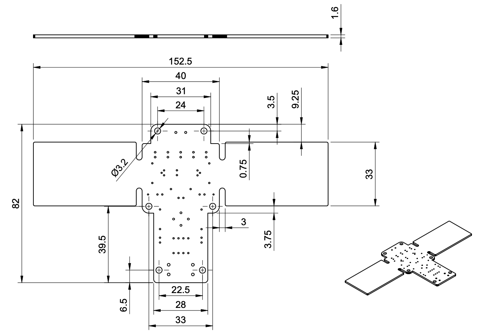

*Rysunek 1: Wymiary płytki PCB*

### 2.2. Montaż

Urządzenie jest przeznaczone do samodzielnego montażu, dlatego zastosowano w nim łatwe do lutowania elementy przewlekane (THT).

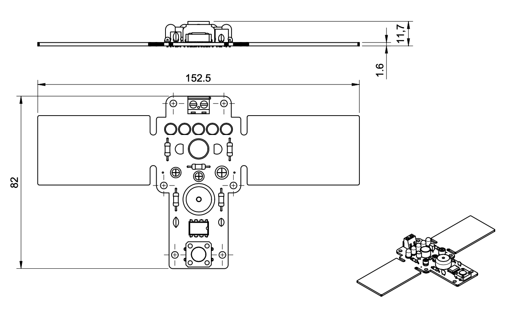

*Rysunek 2: Płytka z wlutowanymi elementami*

Całkowita masa urządzenia (PCB z komponentami): około 40 g.

### 2.3. Zasilanie

Układ może być zasilany napięciem stałym z zakresu od 3 V do 9 V. Daje to szeroki wybór źródła zasilania – np. USB (zasilacz, ładowarka, laptop, power bank) lub popularne baterie (1,5 V typu AA lub AAA).

Maksymalny pobór prądu: poniżej 200 mA.

## 3. Opis urządzenia

Urządzenie składa się z dwóch niezależnych analogowych układów elektronicznych realizujących następujące funkcje:

- **klucz telegraficzny** – układ emitujący dźwięk po naciśnięciu przycisku,
- **klaskacz** – układ reagujący na dźwięk świeceniem diod LED.

Projekt wykorzystuje zróżnicowany zestaw elementów elektronicznych, takich jak rezystory, kondensatory, tranzystory, układy scalone, diody LED, przetworniki dźwięku, a także elementy mechaniczne. Ten zróżnicowany zestaw komponentów stanowi cenne narzędzie edukacyjne dla użytkowników, którzy mogą dowiedzieć się o zastosowaniach różnych komponentów, zrozumieć ich działanie i zależności między nimi.

### 3.1. Budowa

#### 3.1.1. Płytka PCB

Zaprojektowana płytka PCB jest dwustronna (dwuwarstwowa), pokryta niebieską maską lutowniczą z opisami od strony elementów. Boczne skrzydła, przypominające panele słoneczne satelity, nie są częścią układu elektronicznego – stanowią jedynie ozdobę i miejsce na logo.

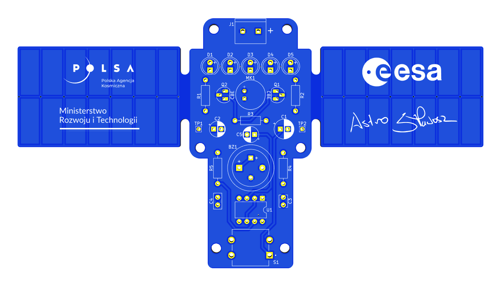

*Rysunek 3: Płytka PCB – strona elementów*

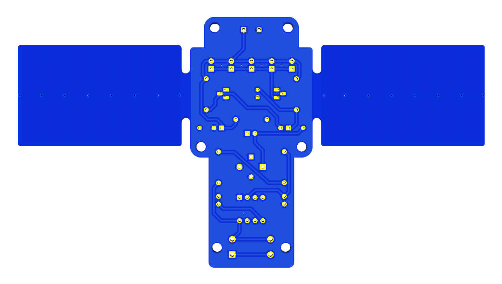

*Rysunek 4: Płytka PCB – strona lutowania*

#### 3.1.2. Rozmieszczenie komponentów

Poniższy rysunek przedstawia wizualizację płytki drukowanej z rozmieszczonymi komponentami i podziałem na układy elektroniczne realizujące określone funkcje.

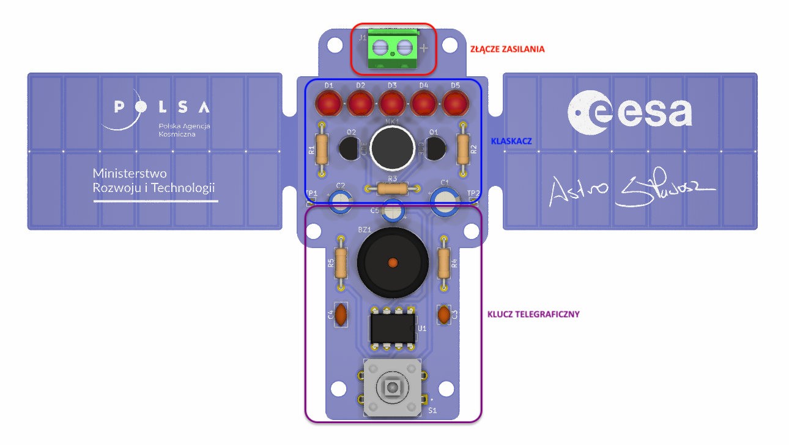

*Rysunek 5: Rozmieszczenie komponentów na płytce PCB*

### 3.2. Klucz telegraficzny

Obwód elektroniczny realizujący funkcję klucza telegraficznego składa się z następujących elementów:

- mikroprzełącznik,
- generator astabilny,
- brzęczyk piezoelektryczny.

Po naciśnięciu mikroprzełącznika monostabilnego (S1) włączane jest zasilanie obwodu generatora astabilnego, który generuje zmienny sygnał dla brzęczyka piezoelektrycznego (BZ1). Brzęczyk przetwarza zmienne napięcie elektryczne w sygnał akustyczny.

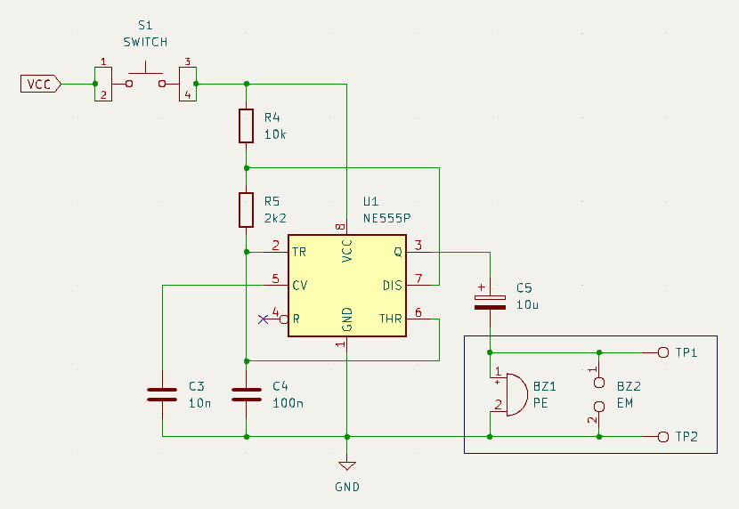

*Rysunek 6: Schemat układu klucza telegraficznego*

Generator astabilny zbudowany na układzie timera NE555P (U1) to proste, ale wszechstronne rozwiązanie służące do generowania sygnałów prostokątnych o zmiennej częstotliwości i współczynniku wypełnienia. Jego elastyczność, niezawodność i łatwość implementacji czynią go popularnym rozwiązaniem w wielu aplikacjach elektronicznych.

Podczas działania układu kondensator C4 jest cyklicznie ładowany i rozładowywany. Układ NE555P kontroluje ten proces i zmienia stan logiczny na wyjściu Q, generując okresowy przebieg prostokątny.

Kondensator C3 służy do blokowania szybkich zmian napięć odniesienia podawanych na układ U1 z dzielnika.

Częstotliwość generowanego przebiegu można wyznaczyć zgodnie z zależnością:

$$f = \frac{1{,}44}{(R_4 + 2R_5)\,C_4}$$

Współczynnik wypełnienia generowanego przebiegu:

$$D = \frac{R_4 + R_5}{R_4 + 2R_5}$$

Wartości rezystancji R4 i R5 oraz pojemność kondensatora C4 mają bezpośredni wpływ na częstotliwość i cykl pracy generowanego przebiegu:

- zwiększenie C4 zwiększy czas cyklu, a tym samym zmniejszy częstotliwość,
- zwiększenie R4 zwiększy czas trwania stanu wysokiego (*Time High*), ale nie wpłynie na czas trwania stanu niskiego (*Time Low*),
- zwiększenie R5 zwiększy czas trwania stanu wysokiego (*Time High*), zwiększy czas trwania stanu niskiego (*Time Low*) i zmniejszy cykl pracy (do minimum 50%).

Generowany sygnał podawany na brzęczyk można obserwować, podłączając oscyloskop do punktów pomiarowych TP1 i TP2 (masa) na płytce drukowanej.

Poniższy rysunek przedstawia obliczenia wykonane dla wartości elementów użytych w obwodzie.

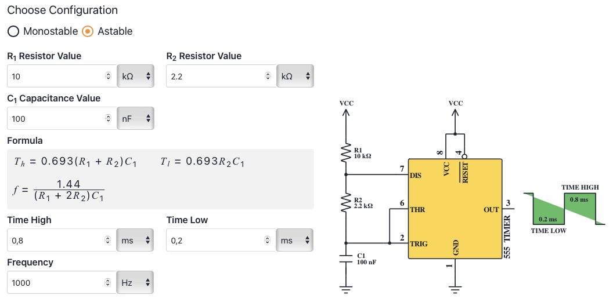

*Rysunek 7: Wyliczone parametry przebiegu dla R4 = 10 kΩ, R5 = 2,2 kΩ i C4 = 100 nF*

Parametry rzeczywistego przebiegu mogą się różnić od wyliczonych ze względu na tolerancję wartości komponentów zastosowanych do budowy układu.

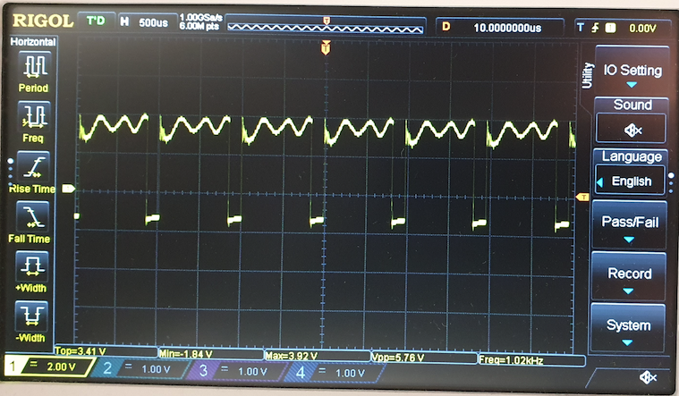

*Rysunek 8: Rzeczywisty przebieg obserwowany na oscyloskopie*

Zmiana rezystancji R4 na 15 kΩ spowoduje zmniejszenie częstotliwości generowanego przebiegu.


*Rysunek 9: Zmiana parametrów po zwiększeniu rezystancji R4*

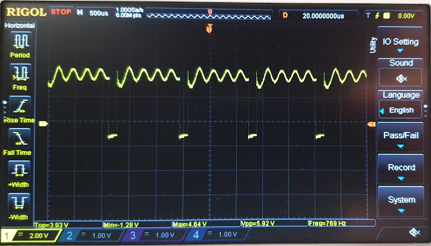

*Rysunek 10: Przebieg po zwiększeniu rezystancji R4*

Zamiana miejscami rezystancji R4 i R5 oraz zmniejszenie pojemności C4 do 22 nF powoduje zwiększenie częstotliwości generowanego przebiegu i zmniejszenie współczynnika wypełnienia. Może to poprawić brzmienie brzęczyka.

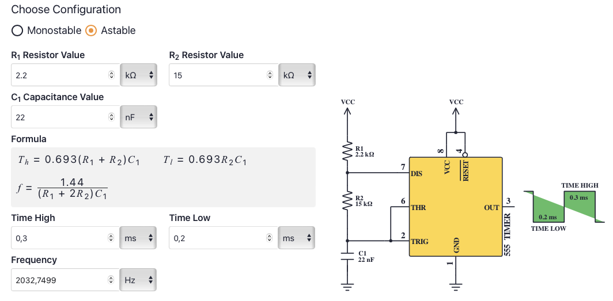

*Rysunek 11: Zwiększenie częstotliwości generowanego przebiegu*

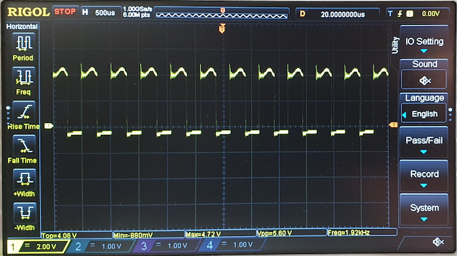

*Rysunek 12: Rzeczywisty przebieg po zwiększeniu częstotliwości*

Zamiast brzęczyka piezoelektrycznego można zastosować brzęczyk elektromagnetyczny (również bez wbudowanego generatora). Na płytce są otwory dostosowane do mniejszego rastra wyprowadzeń i średnicy tego typu komponentu.

### 3.3. Klaskacz

W układzie realizującym funkcjonalność klaskacza można wyróżnić:

- mikrofon z układem przedwzmacniacza,
- wzmacniacz sygnału,
- wskaźnik zbudowany z diod LED.

Mikrofon reaguje na zmiany ciśnienia akustycznego w otoczeniu, generując zmienne napięcie wyjściowe proporcjonalne do natężenia dźwięku. Sygnał ten jest wzmacniany i wykorzystany do wysterowania diod LED.

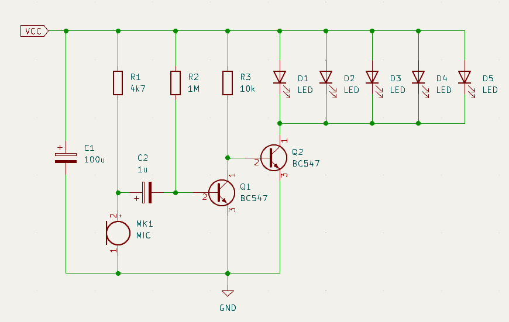

*Rysunek 13: Schemat układu „klaskacza”*

Zastosowany mikrofon elektretowy (MK1) charakteryzuje się niewielkimi rozmiarami, niską impedancją wyjściową i szerokim zakresem częstotliwości. Ten typ mikrofonu posiada wbudowany przedwzmacniacz w postaci tranzystora polowego. Tranzystor ten musi być zasilany z zewnętrznego źródła napięcia poprzez rezystor polaryzujący R1, który pełni również rolę obciążenia. Wartość tego rezystora jest dobierana tak, żeby zapewnić odpowiednie napięcie pracy mikrofonu, i ma również wpływ na wzmocnienie. Kondensator C2 na wyjściu służy do eliminacji składowej stałej.

Tranzystory Q1 i Q2 służą do wzmacniania sygnału z mikrofonu i sterowania diodami LED. Zmiany sygnału mikrofonu powodują zmiany prądu kolektora tranzystora Q2, zmieniając w ten sposób intensywność diod LED. Rezystor R3 może być używany do regulacji jasności diod LED.

## 4. Lista komponentów (BOM)

### 4.1. Elementy montowane na płytce PCB

Wszystkie elementy do montażu przewlekanego (THT).

| Element | Wartość/typ | Opis | Obudowa | Symbol (producent) – przykład |
|---------|-------------|------|---------|-------------------------------|
| R1 | 4.7kΩ[^1] | Rezystor węglowy, 0.25W, ±5% | Osiowa, Ø2.3x6mm | CF1/4W-4K7 (SR Passives) |
| R2 | 1MΩ | Rezystor węglowy, 0.25W, ±5% | Osiowa, Ø2.3x6mm | CF1/4W-1M (SR Passives) |
| R3 | 10kΩ[^2] | Rezystor węglowy, 0.25W, ±5% | Osiowa, Ø2.3x6mm | CF1/4W-10K (SR Passives) |
| R4 | 10kΩ[^3] | Rezystor węglowy, 0.25W, ±5% | Osiowa, Ø2.3x6mm | CF1/4W-10K (SR Passives) |
| R5 | 2.2kΩ | Rezystor węglowy, 0.25W, ±5% | Osiowa, Ø2.3x6mm | CF1/4W-2K2 (SR Passives) |
| C3 | 10nF | Kondensator ceramiczny, 50V | 2.54mm | CC-10N (SR Passives) |
| C4 | 100nF[^4] | Kondensator ceramiczny, 50V | 2.54mm | CC-100N (SR Passives) |
| C1 | 100µF | Kondensator elektrolityczny, 25V | Ø6x11mm, 2.5mm | EWH1EV101E11OT (Aishi) |
| C2 | 1µF | Kondensator elektrolityczny, 50V | Ø5x11mm, 2.5mm | EWH1HM010D11X25T (Aishi) |
| C5 | 10µF | Kondensator elektrolityczny, 50V | Ø5x11mm, 2.5mm | EWH1HM100D11X25T (Aishi) |
| U1 | NE555P | Układ scalony, timer | DIP8 | NE555P (Texas Instruments) |
| Q1, Q2 | BC547B[^5] | Tranzystor bipolarny NPN | TO92 | BC547B (Diotec) |
| D1..D5 | | Dioda LED, dyfuzyjna, niebieska, jasność do 1000mcd | 5mm, czoło wypukłe | L-7113QBDL-D (Kingbright) |
| MK1[^6] | | Mikrofon elektretowy, 1..10V, 0.5mA, -44dB (min.) | Ø9.7mm, 2.5mm | LD-MC-9765P (LOUDITY) |
| BZ1 | | Brzęczyk piezoelektryczny bez generatora, 1..10V, 1mA | Ø13.8x6.8mm, 7.6mm | AT-1438-TWT-R (PUI AUDIO) |
| S1 | | Mikroprzełącznik monostabilny | 12x12x4.3mm | TACT-24N (NINIGI) |
| J1 | | Złącze śrubowe, kątowe 90º, dwutorowe | 5.08mm | 282837-2 (TE CONNECTIVITY) lub TB-5.08-P-2P/BL (NINIGI) |

Dodatkowe elementy dołączane do zestawu (do eksperymentów, niemontowane na stałe):

| Element | Zamiennik dla | Liczba sztuk |
|---------|:-------------:|:------------:|
| Rezystor 4.7kΩ | R3 | 1 |
| Rezystor 15kΩ | R3, R4, R5 | 2 |
| Rezystor 30kΩ | R3 | 1 |
| Kondensator ceramiczny 22nF | C4 | 1 |

[^1]: Alternatywnie 10kΩ w zależności od czułości zastosowanego mikrofonu – zwiększenie rezystancji może poprawić działanie układu klaskacza.
[^2]: Zmiana rezystancji R3 w zależności od napięcia zasilania układu powoduje zmianę intensywności świecenia diod LED – przy wyższym napięciu zasilania zwiększenie rezystancji zmniejszy intensywność świecenia diod LED i może w niektórych przypadkach poprawić brzmienie brzęczyka (proponowane dodatkowe rezystory 4.7kΩ, 15kΩ i 30kΩ).
[^3]: Do zestawu powinny być dodane inne wartości rezystorów R4 i R5, aby umożliwić eksperymenty związane ze zmianą parametrów generowanego przebiegu (proponowany dodatkowy rezystor 15kΩ).
[^4]: Podobnie jak rezystory R4 i R5, pojemność C4 ma również bezpośredni wpływ na parametry generowanego przebiegu, więc do zestawu powinna być dodana również inna wartość pojemności (np. 22nF).
[^5]: Układ został przetestowany również z innymi typami tranzystorów NPN (BC183, BC546, BC548, BC549, BC550).
[^6]: Najlepiej sprawdził się mikrofon OEM, dla którego nie udało się ustalić symbolu i nazwy producenta, a także uzyskać karty katalogowej – w tabeli podany został komponent alternatywny zastosowany w wersji dla ISS. Mikrofon OEM jest dostępny pod kodem UCC-00740.

### 4.2. Komponenty dodatkowe

Proponowane elementy dodatkowe związane z wyborem źródła zasilania:

- koszyk na 2 lub 3 baterie (typu AA lub AAA) z przewodami – w zestawie 1 szt. (koszyk na 2 baterie AAA),
- wtyk USB typ A na przewód do lutowania – 1 szt.

Koszyk na baterie lub przygotowany kabel z wtyczką USB należy podłączyć do złącza zaciskowego śrubowego na płytce PCB (oznaczonego symbolem J1) z zachowaniem odpowiedniej polaryzacji.

| 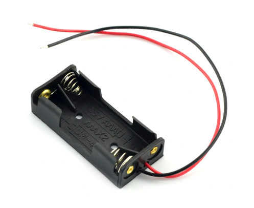 | 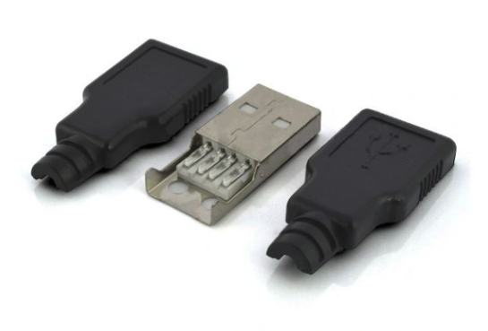 |
|:---:|:---:|
| *Rysunek 14: Koszyk na baterie 2xAAA* | *Rysunek 15: Wtyczka USB z obudową* |

Opcjonalne elementy montażowe:

- kołki dystansowe poliamidowe (M3, 10mm) – 6 szt.,
- śruby nylonowe (M3, 6mm) – 6 szt.

## 5. Testy

### 5.1. Pobór prądu

Urządzenie charakteryzuje się niskim zużyciem energii. Testy z wykorzystaniem modułu analizy parametrów zasilania (*Power Profiler Kit*) jako źródła zasilania wykazały, że podczas normalnej pracy przy napięciu zasilania 5 V szczytowe wartości prądu nie przekraczają 150 mA.

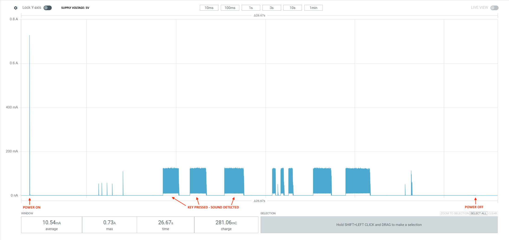

*Rysunek 16: Pobór prądu podczas pracy urządzenia przy napięciu zasilania 5 V*

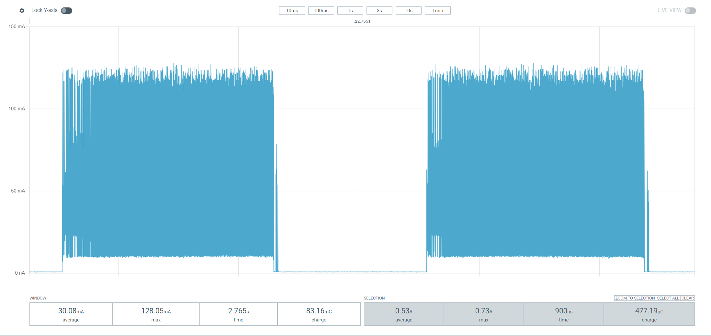

*Rysunek 17: Pobór prądu podczas używania klucza telegraficznego*

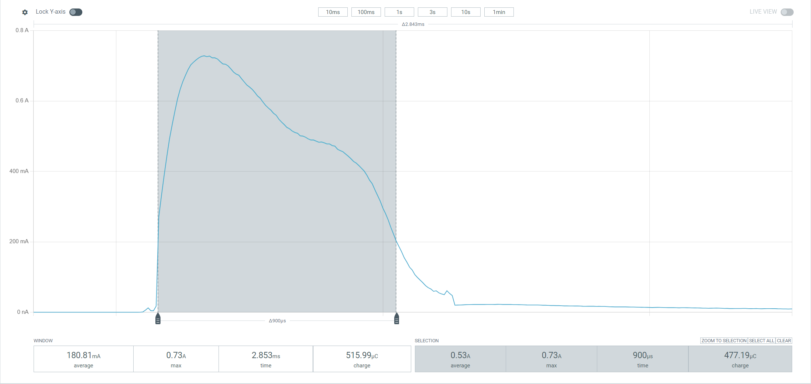

*Rysunek 18: Prąd rozruchowy w chwili uruchomienia urządzenia*

## 6. Informacje dotyczące produkcji

### 6.1. Płytka PCB – specyfikacja techniczna

| Parametr | Wartość |
|----------|---------|
| Rodzaj laminatu | FR-4 |
| Wymiary zewnętrzne płytki | 153x82mm (1.26dm²) |
| Grubość laminatu bazowego | 1.55mm |
| Liczba warstw | 2 |
| Grubość miedzi | 35µm (1oz) |
| Liczba otworów na płytce | 58 + 6 montażowych |
| Metalizacja otworów | Tak |
| Maska lutownicza (soldermaska) | Dwustronna w kolorze niebieskim |
| Cynowanie | HAL |
| Nietypowy kształt płytki | Tak |
| Frezowanie płytki i otworów | Tak |
| Opis (silkscreen) | Jednostronny w kolorze białym |
